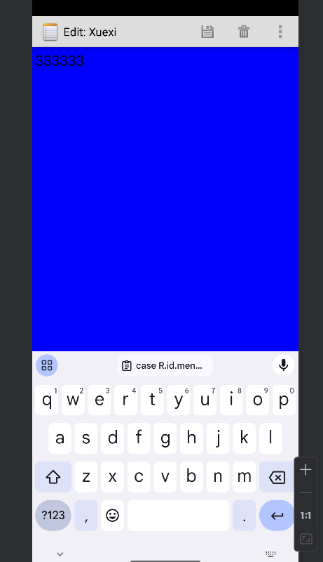

# NotePad - Android 便签应用

### 简介

#### NotePad 是一个简单的 Android 便签小应用 , 用户可以轻松地添加、删除、搜索和管理便签内容。


## 基础功能

###   标签目录具有时间戳：能更方便地查看便签的更新时间。

设置布局文件，嵌套线性布局
将title和时间绑定在ListView中
    

    <LinearLayout xmlns:android="http://schemas.android.com/apk/res/android"
        android:layout_width="match_parent"
        android:layout_height="match_parent"
        android:orientation="vertical"> <!-- 外层线性布局设置为垂直方向 -->
    
        <LinearLayout
            android:layout_width="match_parent"
            android:layout_height="60dp"
            android:orientation="horizontal"> 
    
            <TextView
                android:id="@android:id/text1"
                android:layout_width="211dp"
                android:layout_height="?android:attr/listPreferredItemHeight"
                android:gravity="center_vertical"
                android:paddingLeft="5dip"
                android:singleLine="true"
                android:textAppearance="?android:attr/textAppearanceLarge" />
    
            <TextView
                android:id="@android:id/text2"
                android:layout_width="203dp"
                android:layout_height="?android:attr/listPreferredItemHeight"
                android:gravity="center_vertical"
                android:paddingLeft="5dip"
                android:singleLine="true"
                android:textAppearance="?android:attr/textAppearanceLarge"
                android:textSize="16sp" />
    
        </LinearLayout>
    
    </LinearLayout>
    


   

在PROJECT中添加关于更新时间的请求   

        private static final String[] PROJECTION = new String[] {
            NotePad.Notes._ID, // 0
            NotePad.Notes.COLUMN_NAME_TITLE, // 1
            NotePad.Notes.COLUMN_NAME_MODIFICATION_DATE
        };
-

        String[] dataColumns = { NotePad.Notes.COLUMN_NAME_TITLE ,NotePad.Notes.COLUMN_NAME_MODIFICATION_DATE} ;
        // The view IDs that will display the cursor columns, initialized to the TextView in
        int[] viewIDs = { android.R.id.text1,android.R.id.text2 };

但要注意的是，此时数据库返回的时间不是我们常用的日期格式，这里是设置日期格式代码

    adapter.setViewBinder(new SimpleCursorAdapter.ViewBinder() {
                @Override
                public boolean setViewValue(View view, Cursor cursor, int columnIndex) {
                    if (columnIndex == 2) {
                        long dateLong = cursor.getLong(columnIndex);
                        Date date = new Date(dateLong);
                        SimpleDateFormat outputFormat = new SimpleDateFormat("yyyy年MM月dd日 HH:mm", Locale.getDefault());
                        String formattedDate = outputFormat.format(date);
                        ((TextView) view).setText(formattedDate);
                        return true;
                    }
                    return false;
                }
            });
        // Sets the ListView's adapter to be the cursor adapter that was just created.
        setListAdapter(adapter);
    }

### 查询笔记功能，通过笔记标题来查询所需要的笔记

#### 初始化搜索栏的控件

在noteList的主菜单栏中添加了一项搜索功能


       <item android:id="@+id/menu_search"
            android:icon="@drawable/search"
            android:title="@string/menu_search"
            android:alphabeticShortcut='s'
            android:showAsAction="always" />
    
        <item android:id="@+id/menu_2"
            android:icon="@drawable/search"
            android:title="@string/menu_search" />
#### NoteList:

    @Override
        public boolean onOptionsItemSelected(MenuItem item) {
            switch (item.getItemId()) {
                case R.id.menu_add:
              /*
               * Launches a new Activity using an Intent. The intent filter for the Activity
               * has to have action ACTION_INSERT. No category is set, so DEFAULT is assumed.
               * In effect, this starts the NoteEditor Activity in NotePad.
               */
                    startActivity(new Intent(Intent.ACTION_INSERT, getIntent().getData()));
                    return true;
                case R.id.menu_paste:
              /*
               * Launches a new Activity using an Intent. The intent filter for the Activity
               * has to have action ACTION_PASTE. No category is set, so DEFAULT is assumed.
               * In effect, this starts the NoteEditor Activity in NotePad.
               */
                    startActivity(new Intent(Intent.ACTION_PASTE, getIntent().getData()));
                    return true;
                case R.id.menu_search:
                    // 在这里添加查询功能的实现代码，比如弹出输入框获取关键字，然后修改上面提到的managedQuery的参数进行查询
                    final EditText input = new EditText(this);
                    // 配置输入框相关属性等
                    final String[] dataColumns = { NotePad.Notes.COLUMN_NAME_TITLE,NotePad.Notes.COLUMN_NAME_MODIFICATION_DATE } ;
    
                    // The view IDs that will display the cursor columns, initialized to the TextView in
                    // noteslist_item.xml
                    final int[] viewIDs = { android.R.id.text1 ,android.R.id.text2};
                    AlertDialog.Builder builder = new AlertDialog.Builder(this);
                    builder.setTitle("输入查询关键字")
                            .setView(input)
                            .setPositiveButton("查询", new DialogInterface.OnClickListener() {
                                @Override
                                public void onClick(DialogInterface dialog, int which) {
                                    String keyword = input.getText().toString();
                                    Cursor cursor = managedQuery(
                                            getIntent().getData(),
                                            PROJECTION,
                                            NotePad.Notes.COLUMN_NAME_TITLE + " LIKE?", // 假设按标题查询，使用模糊查询，实际可能要按更多条件
                                            new String[]{"%" + keyword + "%"},
                                            NotePad.Notes.DEFAULT_SORT_ORDER
                                    );
                                    SimpleCursorAdapter newAdapter = new SimpleCursorAdapter(
                                            NotesList.this,
                                            R.layout.noteslist_item,
                                            cursor,
                                            dataColumns,
                                            viewIDs
                                    );
                                    newAdapter.setViewBinder(new SimpleCursorAdapter.ViewBinder() {
                                        @Override
                                        public boolean setViewValue(View view, Cursor cursor, int columnIndex) {
                                            if (columnIndex == 2) {
                                                long dateLong = cursor.getLong(columnIndex);
                                                Date date = new Date(dateLong);
                                                SimpleDateFormat outputFormat = new SimpleDateFormat("yyyy年MM月dd日 HH:mm", Locale.getDefault());
                                                String formattedDate = outputFormat.format(date);
                                                ((TextView) view).setText(formattedDate);
                                                return true;
                                            }
                                            return false;
                                        }
                                    });
                                    setListAdapter(newAdapter);
                                }
                            })
                            .setNegativeButton("取消", null)
                            .show();
                    return true;
    
            default:
                return super.onOptionsItemSelected(item);
            }
  }


### 拓展功能

#### 1、导出文件

#### 在原有的editor_options_menu菜单栏添加一个菜单

    <item android:id="@+id/menu_export_note"
            android:title="@string/menu_export_note"
            android:showAsAction="ifRoom|withText" />


#### 为菜单设置点击事件

#### 在NoteEditor中onOptionsItemSelected方法中添加点击事件

            case R.id.menu_export_note:
                    exportNote();
                    break;
#### 其中 exortNote方法
    private void exportNote() {
            // 获取笔记内容
            String noteContent = mText.getText().toString();
            if (noteContent.isEmpty()) {
                Toast.makeText(this, "笔记内容为空，无需导出", Toast.LENGTH_SHORT).show();
                return;
            }
    
            // 检查外部存储是否可用
            if (!isExternalStorageWritable()) {
                Toast.makeText(this, "外部存储不可用，无法导出笔记", Toast.LENGTH_SHORT).show();
                return;
            }
    
            // 创建文件，这里以当前日期命名笔记文件，格式为txt
            String fileName = "note_" + System.currentTimeMillis() + ".txt";
            File file = new File(Environment.getExternalStoragePublicDirectory(
                    Environment.DIRECTORY_DOCUMENTS), fileName);
    
            try {
                FileOutputStream fos = new FileOutputStream(file);
                fos.write(noteContent.getBytes());
                fos.close();
                Toast.makeText(this, "笔记已成功导出至 " + file.getAbsolutePath(), Toast.LENGTH_LONG).show();
            } catch (IOException e) {
                e.printStackTrace();
                Toast.makeText(this, "导出笔记时出现错误", Toast.LENGTH_SHORT).show();
            }
        }
#### 里面的 isExternalStorageWritable方法
    // 检查外部存储是否可写的方法
        private boolean isExternalStorageWritable() {
            String state = Environment.getExternalStorageState();
            return Environment.MEDIA_MOUNTED.equals(state);
        }


#### 点击导出笔记会跳出Toast


#### 存储到本机的Documents里


#### 点击刚刚保存的文件


## 2、UI美化

#### 更改notelistItem的背景

#### 添加修改背景的菜单

    <item android:id="@+id/menu_change_background"
            android:icon="@drawable/change_background"
            android:title="@string/menu_change"
            android:showAsAction="ifRoom|withText" />


#### 在NoteEditor中onOptionsItemSelected方法中添加点击事件

```
case R.id.menu_change_background:
                // 创建一个颜色选择对话框，这里使用Android内置的ColorPickerDialog示例（实际中可根据需求优化或替换）
                final int[] selectedColor = {Color.WHITE};  // 默认初始颜色为白色
                AlertDialog.Builder builder = new AlertDialog.Builder(this);
                builder.setTitle("选择背景颜色");
                builder.setPositiveButton("确定", new DialogInterface.OnClickListener() {
                    @Override
                    public void onClick(DialogInterface dialog, int which) {
                        // 设置EditText的背景颜色为用户选择的颜色
                        mText.setBackgroundColor(selectedColor[0]);
                    }
                });
                builder.setNegativeButton("取消", null);
                builder.setSingleChoiceItems(new String[]{"红色", "绿色", "蓝色", "白色", "黑色"}, 0, new DialogInterface.OnClickListener() {
                    @Override
                    public void onClick(DialogInterface dialog, int which) {
                        switch (which) {
                            case 0:
                                selectedColor[0] = Color.RED;
                                break;
                            case 1:
                                selectedColor[0] = Color.GREEN;
                                break;
                            case 2:
                                selectedColor[0] = Color.BLUE;
                                break;
                            case 3:
                                selectedColor[0] = Color.WHITE;
                                break;
                            case 4:
                                selectedColor[0] = Color.BLACK;
                                break;
                        }
                    }
                });
                builder.show();
                break;
```

#### 


#### 修改界面


#### 修改效果



